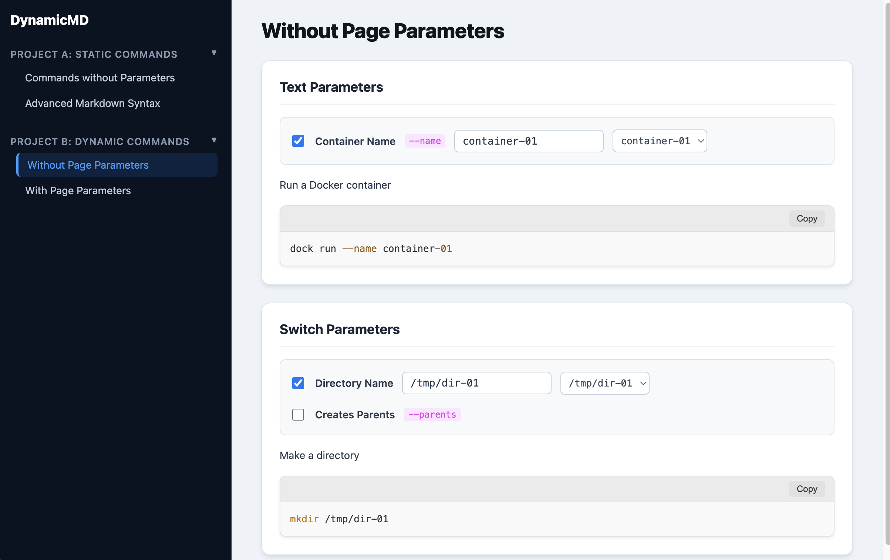

# DynamicMD

DynamicMD is a simple but powerful tool that transforms your Markdown documentation into a fully interactive website. It's perfect for creating command-line references, API documentation, or any other content where you want to provide users with dynamically generated code snippets.



## What is DynamicMD?

At its core, DynamicMD is a Flask-based web application that parses a special flavor of Markdown and renders it as a single-page web application. It allows you to define variables and controls directly within your Markdown file, which are then turned into interactive form elements in the UI. When users change these controls, the code blocks on the page update in real-time.

## Features

*   **Markdown-driven content**: All your content is managed in a standard Markdown file.
*   **Interactive Parameters**: Define text inputs, switches, and dropdowns using a simple `@param` syntax.
*   **Dynamic Code Blocks**: Code snippets update automatically based on user input.
*   **Automatic Navigation**: A sidebar navigation is generated from the headings in your Markdown file.
*   **Syntax Highlighting**: Code blocks are beautifully highlighted using highlight.js.
*   **Customizable**: The port and source Markdown file can be configured via command-line arguments.

## How it Works

DynamicMD uses a Python **Flask** backend to parse the Markdown file and serve the frontend. The frontend is a single HTML file with vanilla JavaScript that renders the UI and handles the interactive elements.

1.  The Flask server reads a `.md` file.
2.  A custom parser transforms the Markdown into a JSON structure, paying special attention to headings and `@param` annotations.
3.  This JSON data is injected into the `index.html` template.
4.  JavaScript in the browser uses this data to build the sidebar, content cards, and interactive parameter controls.
5.  As you interact with the controls, the JavaScript updates the text content of the code blocks on the fly.

## Getting Started

### Prerequisites

*   Python 3.x
*   pip (Python package installer)

### Installation

Install the required Python packages:
```bash
pip install Flask Markdown
```

## Usage

To start the web server, run `app.py`.

```bash
python app.py [markdown_file] [port]
```

*   `markdown_file` (optional): The path to the Markdown file you want to display. Defaults to `example.md`.
*   `port` (optional): The port on which to run the server. Defaults to `5000`.

**Examples:**

*   Run with the default `example.md` on port 5000:
    ```bash
    python app.py
    ```
*   Run with a custom file on the default port:
    ```bash
    python app.py my_docs.md
    ```
*   Run with a custom file and a custom port:
    ```bash
    python app.py my_docs.md 8080
    ```

Once the server is running, open your web browser and navigate to `http://127.0.0.1:5000` (or your custom port).

## Creating Content

### File Structure

The application uses Markdown headings to structure the page:

*   `# Heading 1`: Creates a new category in the sidebar.
*   `## Heading 2`: Creates a new selectable item within a category. This corresponds to a "page" in the main content area.
*   `### Heading 3`: Creates a new card within a page.

### Interactive Parameters

The real power of DynamicMD comes from its `@param` syntax. You can define a parameter on its own line. These parameters are scoped to the section they are defined in (`##` or `###`).

```
@param <id> { <options> }
```

*   `<id>`: A unique identifier for the parameter. This is used in the code blocks for substitution.
*   `<options>`: A space-separated list of key-value pairs that configure the parameter.

**Available Options:**

| Key       | Description                                                                 | Example                               |
|-----------|-----------------------------------------------------------------------------|---------------------------------------|
| `name`    | The display name for the parameter in the UI.                               | `name="Container Name"`               |
| `type`    | The type of UI control. Can be `text` or `switch`.                          | `type=text`                           |
| `prefix`  | A string that is prepended to the value in the code block.                  | `prefix="--name"`                     |
| `default` | The default value for the parameter.                                        | `default=value1`                |
| `enabled` | Whether the parameter is enabled by default (`true` or `false`).            | `enabled=false`                       |
| `options` | A comma-separated list of predefined values to create a dropdown selector.  | `options=[value1,value2,value3]`      |


**Example Parameter:**

```markdown
@param name { name="Container Name" type=text prefix="--name" default=my-app options=[my-app,db,web] }
```

#### Parameter Types (`type`)

The `type` option defines the kind of UI control generated for the parameter.

*   **`type=text`**: Creates a text input field for parameters that require a value. If you also provide an `options` list, a dropdown menu will be shown to help populate the text field. The final output in the code block will be a combination of the `prefix` and the value from the text box.

*   **`type=switch`**: Creates a checkbox for parameters that act as on/off flags (e.g., `--verbose`). When the box is checked, the `prefix` is inserted into the code block. When it's unchecked, nothing is inserted.

#### Parameter Scope (Page vs. Card Parameters)

Parameters can be defined at two different levels:

*   **Page Parameters**: A parameter defined directly under an `##` heading is a "Page Parameter". It is available to **all** code blocks within that entire `##` section. This is useful for variables that are shared across multiple commands on the same page.

*   **Card Parameters**: A parameter defined under a `###` heading is a "Card Parameter". It is only available to the code block within that specific card.

**Using Parameters in Code Blocks:**

To use a parameter's value in a code block, use the `${id}` syntax. The text inside the code block will be dynamically replaced based on the user's input.

**Example of Scopes and Types:**

```markdown
## My Page
# This is a page parameter, available to all cards below
@param dir { name="Directory Name" type=text default="/tmp" }

### Command 1
# This is a card parameter, only for "Command 1"
@param parents { name="Create Parents" type=switch prefix="-p" }

# Both ${parents} and ${dir} are available here
# mkdir ${parents} ${dir}
```

If the user checks the "Create Parents" box and types `/data` in the "Directory Name" input, the code block will automatically update to:

```bash
mkdir -p /data
```

## License

This project is licensed under the MIT License.
